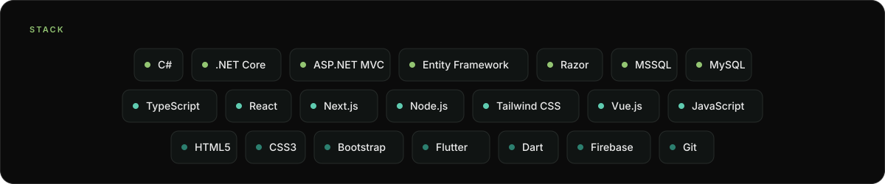
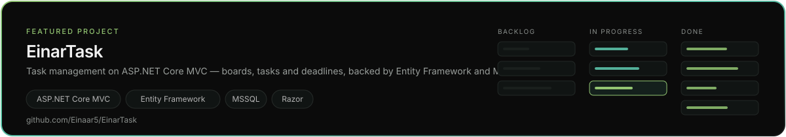
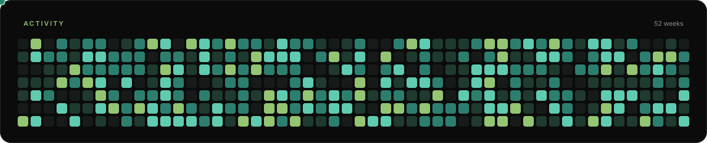

  

<h3 align="center">Can Bayır</h3>

.NET Core developer from Türkiye. I build web apps end to end — ASP.NET Core on the back, clean interfaces on the front, shipped to production.

  <a href="https://www.linkedin.com/in/can-bay%C4%B1r-60a65128a/">LinkedIn</a> &nbsp;·&nbsp;
  <a href="https://instagram.com/einarr_c">Instagram</a> &nbsp;·&nbsp;
  <a href="mailto:canbayirr055@gmail.com">canbayirr055@gmail.com</a>

 

<table align="center">
  <tr><th align="left">Now</th><th align="left">How I work</th></tr>
  <tr><td><b>Building</b> — <a href="https://github.com/Einaar5/EinarTask">EinarTask</a>, task management on ASP.NET Core MVC</td><td><b>01</b> Prototype in the browser — real data, not filler</td></tr>
  <tr><td><b>Learning</b> — Entity Framework Core, MVC architecture</td><td><b>02</b> Systems, not screens — reusable layouts and components</td></tr>
  <tr><td><b>Ask me about</b> — Razor Pages, MVC, MSSQL</td><td><b>03</b> Ship, then refine — small releases, every week</td></tr>
  <tr><td><b>Contact</b> — <a href="mailto:canbayirr055@gmail.com">canbayirr055@gmail.com</a></td><td><b>Based in</b> Istanbul / Remote</td></tr>
</table>

 

<h3 align="center">Stack</h3>

  

 

<h3 align="center">Featured project</h3>

  

 

<h3 align="center">Activity</h3>

  

 

  Istanbul / Remote · Open for new work · <a href="mailto:canbayirr055@gmail.com">canbayirr055@gmail.com</a> · <a href="https://github.com/Einaar5">github.com/Einaar5</a>

